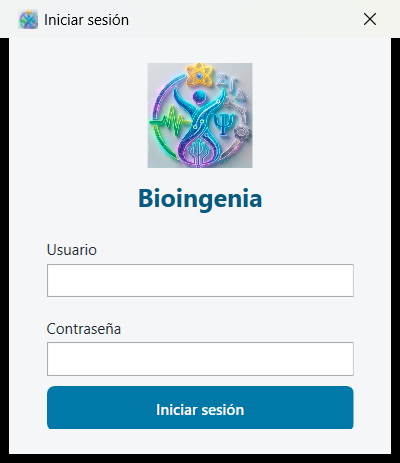
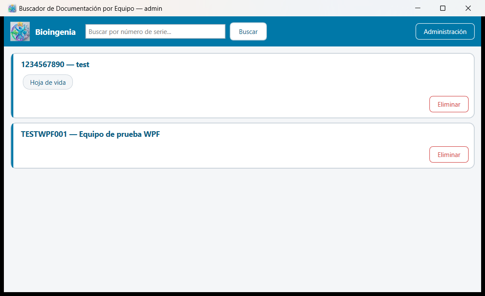
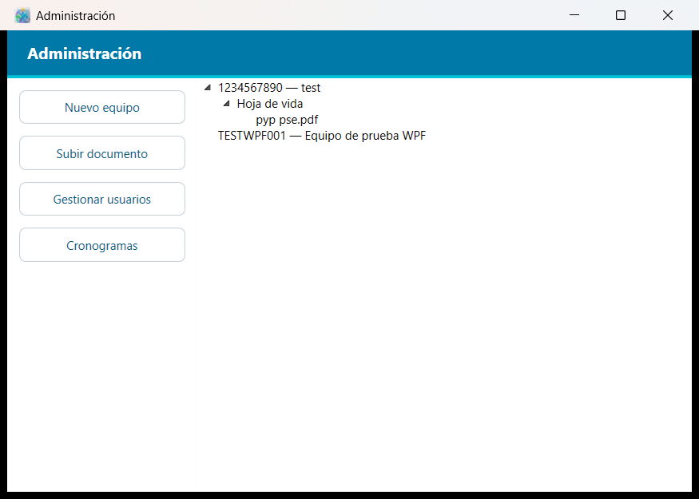
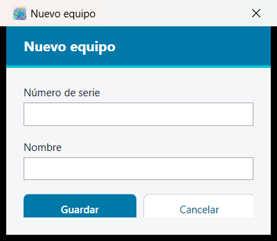
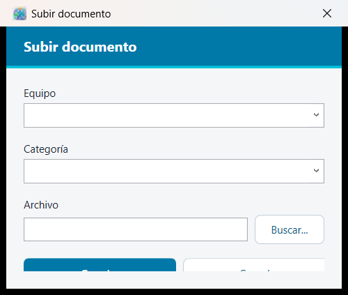
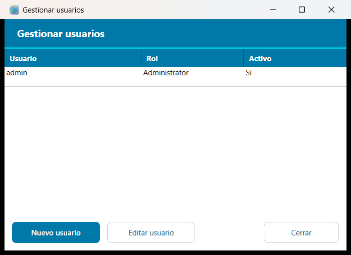
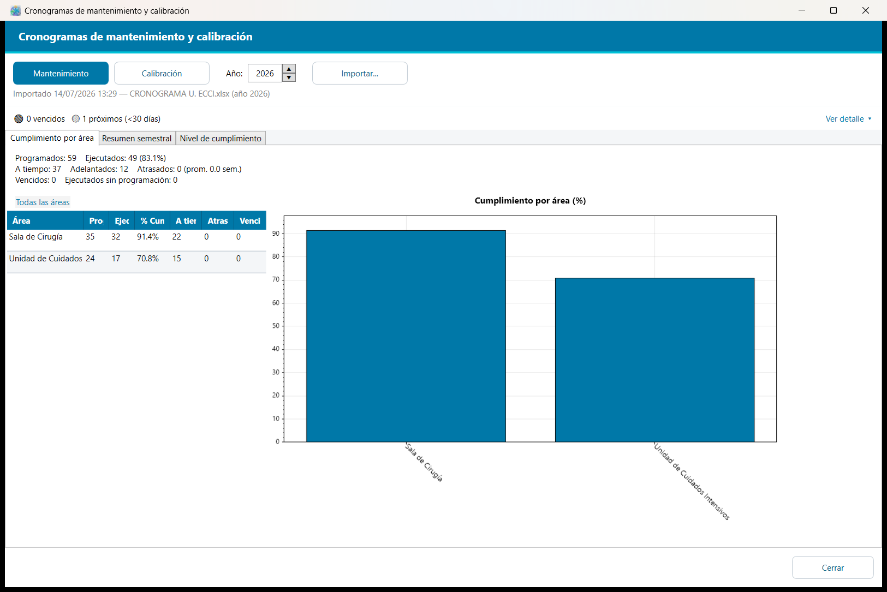

# Manual de usuario — Bioingenia

Guía para ejecutar y probar la aplicación **Bioingenia** desde el código fuente, usando Visual Studio. Como el proyecto todavía no tiene instalador, esta es la forma de levantarlo y mostrar su funcionamiento.

## 1. Requisitos

- **Windows 10 u 11.**
- **Visual Studio 2022** con la carga de trabajo **".NET desktop development"** instalada.
  (Si Visual Studio pide instalar algo al abrir el proyecto, es justamente esa carga de trabajo — acéptala y espera a que termine.)
- No hace falta instalar nada más: la aplicación no usa base de datos ni servicios externos.

## 2. Abrir el proyecto

1. Abre el repositorio en el explorador de archivos y haz doble clic en **`Bioingenia.sln`** (en la raíz del repo). Esto abre Visual Studio con todo el proyecto cargado.
2. En el **Explorador de soluciones** (panel derecho) deberías ver un solo proyecto: **`Bioingenia.Wpf`**. Si aparece en negrita, ya es el "proyecto de inicio" y no hay que hacer nada más. Si no lo está, haz clic derecho sobre `Bioingenia.Wpf` → **"Establecer como proyecto de inicio"**.

## 3. Ejecutar la aplicación

- Presiona **F5** (o el botón ▶ **"Bioingenia.Wpf"** en la barra superior de Visual Studio).
- Visual Studio compila el proyecto y abre la ventana de la aplicación automáticamente.

Si es la primera vez que se ejecuta en este computador, la app va a pedir seleccionar una carpeta antes de mostrar el login — ver el siguiente punto.

## 4. Primer uso: la carpeta de equipos (EQUIPOS_ROOT)

Bioingenia no usa una base de datos: toda la documentación de los equipos vive en una carpeta normal de Windows (llamada **EQUIPOS_ROOT** en la documentación técnica). La primera vez que se ejecuta en un computador, la app pide elegir esa carpeta.

Para una demostración rápida:

1. Crea una carpeta en cualquier lugar (por ejemplo, `C:\Demo\Equipos`).
2. Cuando la app pida la carpeta, selecciona esa carpeta vacía — la app la prepara sola (crea automáticamente el usuario `admin` con contraseña `admin123`).
3. Esa ruta queda guardada en este computador (en `%AppData%\Bioingenieria\config.json`), así que la próxima vez que se ejecute la app no vuelve a preguntar.

> Si en algún momento quieres que la app vuelva a preguntar por la carpeta (por ejemplo, para apuntar a otra carpeta de prueba), borra ese archivo `config.json` y vuelve a ejecutar.

## 5. Iniciar sesión



Usa el usuario que se crea automáticamente la primera vez:

- **Usuario:** `admin`
- **Contraseña:** `admin123`

Este usuario tiene el rol **Administrador**, que es el que puede ver todas las funciones de la app. Se recomienda cambiar esta contraseña cuanto antes desde **Administración → Gestionar usuarios** (ver más abajo).

## 6. Pantalla principal — buscar equipos



Esta es la pantalla que ve cualquier usuario, sin importar su rol:

1. Escribe parte del número de serie de un equipo en el cuadro de búsqueda y presiona **Enter** o el botón **Buscar** (no importan mayúsculas/minúsculas, ni escribir el número completo).
2. Cada resultado aparece como una tarjeta con un botón ("chip") por cada categoría de documento que tenga al menos un archivo (por ejemplo, "Hoja de vida", "Manual de usuario").
   - Si la categoría tiene un solo archivo, el chip lo abre directamente con el programa predeterminado de Windows para ese tipo de archivo (PDF, Word, Excel, etc.).
   - Si tiene varios archivos, el chip muestra un menú para elegir cuál abrir.
3. El botón **Administración**, arriba a la derecha, solo aparece para usuarios con rol Administrador.

## 7. Panel de Administración



Se abre con el botón **Administración** de la pantalla principal. A la izquierda hay cuatro acciones; a la derecha, un árbol de solo lectura con todo lo que hay en la carpeta EQUIPOS_ROOT (equipo → categoría → archivo). Doble clic en un archivo del árbol también lo abre.

### Nuevo equipo



Crea la carpeta de un equipo nuevo a partir de su número de serie y un nombre descriptivo. El número de serie no puede repetirse ni contener caracteres inválidos para un nombre de carpeta.

### Subir documento



1. Elige un equipo ya existente (el campo sugiere mientras escribes).
2. Escribe o elige una categoría — si escribes una que no existe, se crea sola.
3. Presiona **Buscar...** para elegir el archivo desde el explorador de Windows.
4. **Guardar**. Si ya existe un archivo con ese nombre en esa categoría, la app pregunta antes de reemplazarlo.

### Gestionar usuarios



- **Nuevo usuario**: crea un usuario con nombre, contraseña, rol (**Buscador** o **Administrador**) y estado activo/inactivo.
- **Editar usuario**: selecciona una fila de la tabla primero y luego este botón — permite cambiar el rol, activar/desactivar, o poner una contraseña nueva (dejar el campo de contraseña vacío para no cambiarla).
- "Eliminar" un usuario en realidad lo desactiva; no borra su registro, para no perder el historial.

### Cronogramas



Sección para seguimiento de mantenimiento y calibración de equipos:

1. **Importar...** carga un archivo Excel (`.xlsx`) con el cronograma de un año y un tipo (Mantenimiento o Calibración) — el año se elige con el control junto a "Año:".
2. La pestaña **Cumplimiento por área** muestra un resumen y un gráfico de barras por área; haz clic en una fila de la tabla para ver el detalle por equipo de esa área (y en "◀ nombre del área" para volver).
3. **Resumen semestral** muestra un gráfico de torta programado vs. ejecutado, con botones para elegir el semestre.
4. **Nivel de cumplimiento** muestra un semáforo (verde/amarillo/rojo) por área según qué tan atrasada está.
5. Arriba a la derecha, **"Ver detalle"** despliega la lista de próximos vencimientos y vencidos.

## 8. Roles

| Rol | Puede |
|---|---|
| Buscador | Buscar equipos y abrir documentos |
| Administrador | Todo lo anterior + el panel de Administración completo |

Para demostrar el rol **Buscador**, crea un segundo usuario con ese rol desde **Gestionar usuarios**, cierra la aplicación e inícia sesión con ese usuario — vas a notar que el botón **Administración** ya no aparece.

## 9. Preguntas frecuentes

**Visual Studio marca errores antes de compilar / pide restaurar paquetes NuGet.**
Espera unos segundos a que termine de restaurar automáticamente al abrir el proyecto, o haz clic derecho sobre la solución → **"Restaurar paquetes NuGet"**.

**¿Cómo pruebo con datos limpios, sin lo que ya haya en la carpeta de otra demo?**
Apunta a una carpeta EQUIPOS_ROOT distinta: borra `%AppData%\Bioingenieria\config.json` y vuelve a ejecutar — la app va a pedir la carpeta de nuevo (ver punto 4).

**¿Dónde queda guardada la configuración?**
`%AppData%\Bioingenieria\config.json` guarda la ruta de EQUIPOS_ROOT para este computador. Todo lo demás (equipos, documentos, usuarios) vive dentro de la carpeta EQUIPOS_ROOT que hayas elegido, así que esa carpeta se puede copiar o compartir para llevar la misma demo a otro computador.

**¿Se puede compilar y correr por línea de comandos en vez de Visual Studio?**
Sí, si tienes el [.NET 9 SDK](https://dotnet.microsoft.com/download/dotnet/9.0) instalado:

```
dotnet run --project Bioingenia.Wpf/Bioingenia.Wpf.csproj
```
